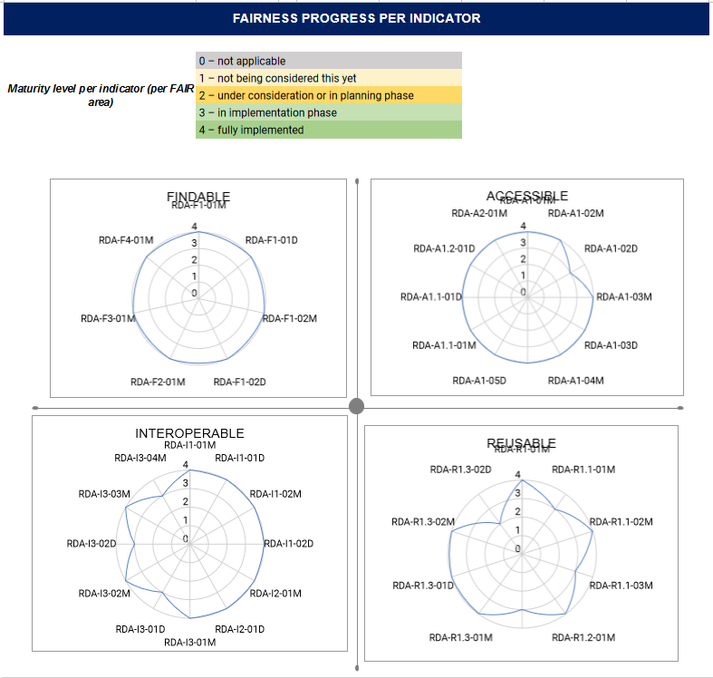

.. _fair_enabled:

FAIR enabled
============

The OpenAIRE and DRIVER guidelines, at the beginning of their time in 2008, had already put the focus on elements that can be found today in the FAIR principles.
Community-based refinement and enhancement of the guidelines over time to include elements with their descriptions that are consistent with motivation of FAIR. 
The following section describe the FAIRification process of the OpenAIRE Guidelines for institutional & thematic Repository Manager.

.. _fair_overview:

Overview
~~~~~~~~

The FAIR maturity model: specification and guidelines of the `Research Data Alliance (RDA) <https://www.rd-alliance.org>`_ (DOI: `10.15497/rda00045 <https://doi.org/10.15497/rda00045>`_)
has the aim to specify the objective indicators for the FAIR assessment. The guidelines are intended to assist evaluators to implement the indicators in the evaluation approach or tool 
they manage.

The indicators shown in the above document have different priorities. The section below is an indication of how to classify elements in our OpenAIRE guidelines for determining the 
FAIRness of a repository.

.. _fair_priorities:

Priorities
~~~~~~~~~~

Three levels of importance are defined:

* **Essential**: 

  such an indicator addresses an aspect that is of the utmost importance to achieve FAIRness under most circumstances, or, 
  conversely, FAIRness would be practically impossible toachieve if the indicator were not satisfied.
  
* **Important**: 

  such an indicator addresses an aspect that might not be of the utmost importance  under  specific  circumstances,  but  
  its  satisfaction,  if  at  all  possible,would substantially increase FAIRness.
  
* **Useful**: 

  such an indicator addresses an aspect that is nice-to-have but is not could indicator MAY be satisfied, but not necessarily indispensable.

Description of Indicators
~~~~~~~~~~~~~~~~~~~~~~~~~

+------------+--------------+--------------------------------------------------------+----------------------+
| Indicator  | short        | Description                                            | Field                |
+============+==============+========================================================+======================+
| RDA-F1-02M | Metadata is  | The indicator serves to evaluate whether the           | Resource Identifier  |
|            |              |                                                        |                      |
|            | identified   | identifier of the metadata is globally unique,         | Alternate Identifier |
|            |              |                                                        |                      |
|            | by a globally| i.e. that there are no two identical identifiers       |                      |
|            |              |                                                        |                      |
|            | unique       | that identify different metadata records.              |                      |
|            |              |                                                        |                      |
|            | identifier   |                                                        |                      |
+------------+--------------+--------------------------------------------------------+----------------------+
| RDA-F2-01M | Rich metadata| The indicator is about the presence of metadata, but   | Implicit             |
|            | is provided  | also about how much metadata is                        |                      |
|            | to allow     | provided and how well the provided metadata            |                      |
|            | discovery    | supports discovery.                                    |                      |
+------------+--------------+--------------------------------------------------------+----------------------+
| RDA-F3-01M | Metadata     | The indicator deals with the inclusion of the reference| File Location        |
|            |              |                                                        |                      |
|            | includes the | (i.e. the identifier) of the digital object            |                      |
|            |              |                                                        |                      |
|            | identifier   | in the metadata so that the digital                    |                      |
|            |              |                                                        |                      |
|            | for the data | object can be accessed.                                |                      |
|            |              |                                                        |                      |
|            |              |                                                        |                      |
+------------+--------------+--------------------------------------------------------+----------------------+
| RDA-F4-01M | Metadata is  | The indicator tests whether the metadata is offered in | Implicit             |
|            | offered in   | such a way that it can be indexed. In some cases,      |                      |
|            | such a way   | metadata could be provided together with the data      |                      |
|            |that it can be| to a local institutional repository or to a domain-    |                      |
|            | harvested and| specific or regional portal, or metadata could be      |                      |
|            | indexed      | included in a landing page where it can be harvested by|                      |
|            |              | a search engine. The indicator remains broad enough    |                      |
|            |              | on purpose not to limit the way how and by whom the    |                      |
|            |              | harvesting and indexing of the data might be done.     |                      |
+------------+--------------+--------------------------------------------------------+----------------------+
|            |              |                                                        |                      |
+------------+--------------+--------------------------------------------------------+----------------------+
| RDA-A1-04M | Metadata is  | The indicator concerns the protocol through which      |                      |
|            |              |                                                        |                      |
|            | accessed     | the metadata is accessed and requires the              |                      |
|            |              |                                                        |                      |
|            | through      | protocol to be defined in a standard.                  |                      |
|            |              |                                                        |                      |
|            | standardised |                                                        |                      |
|            |              |                                                        |                      |
|            | protocol     |                                                        |                      |
+------------+--------------+--------------------------------------------------------+----------------------+

